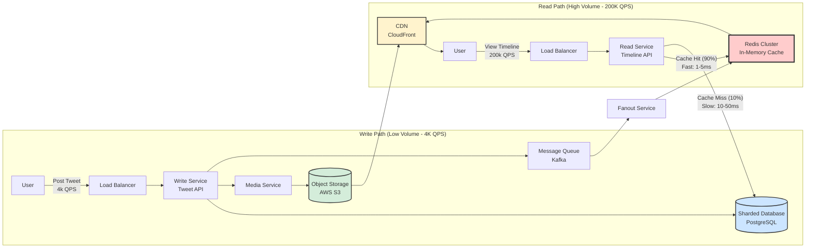

# Back-of-the-Envelope Calculations for System Design

## Table of Contents
- [Introduction](#introduction)
- [Latency Numbers Every Programmer Should Know](#latency-numbers-every-programmer-should-know)
- [Twitter Scale Estimation Example](#twitter-scale-estimation-example)
- [System Architecture Visualization](#system-architecture-visualization)
- [Key Takeaways](#key-takeaways)
- [Interview Tips](#interview-tips)

---

## Introduction

"Back-of-the-envelope" calculations allow you to check if a design is feasible before writing code. In a system design interview, this demonstrates that you understand scale constraints and can make informed architectural decisions based on real numbers.

**Why This Matters:**
- ✅ Shows you understand performance characteristics
- ✅ Helps you choose the right technologies
- ✅ Validates your design decisions with data
- ✅ Impresses interviewers with practical thinking

---

## Latency Numbers Every Programmer Should Know

These are the approximate timings for computer operations. **Memorize the Order of Magnitude** (powers of 10), not the exact digits.

### The Latency Cheat Sheet

| Operation | Time | Human Scale Analogy |
|-----------|------|---------------------|
| L1 Cache Reference | 0.5 ns | Heartbeat |
| L2 Cache Reference | 5 ns | Yawn |
| Main Memory Reference (RAM) | 100 ns | Brushing teeth |
| Read 1MB from RAM | 250 μs (microseconds) | Sprinting 100m |
| Round Trip within Datacenter | 500 μs | Short bike ride |
| Disk Seek | 10 ms (milliseconds) | 1-year project |
| Read 1MB from Network | 10 ms | 1-year project |
| Read 1MB from Disk | 30 ms | 3-year research |
| Packet CA → Netherlands → CA | 150 ms | A human generation |

### Visual Representation

```
┌─────────────────────────────────────────────────────────────┐
│                    LATENCY SCALE                            │
├─────────────────────────────────────────────────────────────┤
│                                                             │
│  L1 Cache         0.5 ns    ▌                              │
│  L2 Cache         5 ns      ▌                              │
│  RAM              100 ns    ██                             │
│  1MB from RAM     250 μs    █████                          │
│  Datacenter RTT   500 μs    ██████████                     │
│  Disk Seek        10 ms     ████████████████████           │
│  1MB from Network 10 ms     ████████████████████           │
│  1MB from Disk    30 ms     ████████████████████████████   │
│  Cross-continent  150 ms    ██████████████████████████████ │
│                                                             │
└─────────────────────────────────────────────────────────────┘
```

### 🎯 Key Takeaways

1. **Memory is ~100x faster than disk**
   - Always prefer in-memory operations when possible
   - Use caching aggressively

2. **Reading from disk is ~10-20x slower than network**
   - Network I/O can be faster than disk I/O
   - Consider distributed caching over local disk

3. **Avoid disk seeks at all costs**
   - Sequential reads are much faster than random access
   - Use SSDs for random access patterns

### Time Unit Conversion Reference

```
1 second (s)       = 1,000 milliseconds (ms)
1 millisecond (ms) = 1,000 microseconds (μs)
1 microsecond (μs) = 1,000 nanoseconds (ns)

Therefore:
1 second = 1,000,000,000 nanoseconds (10^9 ns)
```

---

## Twitter Scale Estimation Example

In an interview, **always start by stating your assumptions**. Use round numbers to make math easy.

### Step A: Assumptions (The Setup)

**User Base:**
- **DAU (Daily Active Users):** 200 Million
- **Monthly Active Users (MAU):** ~400 Million (implied)

**User Behavior:**
- **Write Volume:** Average 2 tweets per user/day
- **Read Volume:** Twitter is read-heavy. Assume a user views 100 tweets per day

**Content Characteristics:**
- **Media:** 10% of tweets contain images/video
- **Tweet Size:**
  - Text-only: 300 Bytes (includes metadata + text)
  - Media: 1 MB (average per media file)

---

### Step B: QPS Calculation (Traffic)

**Formula:** 
```
QPS = (DAU × Actions_Per_Day) / Seconds_In_Day (~86,400)
```

**Simplification:** Round 86,400 seconds to **100,000 (10^5)** for mental math.

#### 1. Write QPS (Tweet Ingestion)

**Daily Tweet Volume:**
```
Total Tweets = DAU × Tweets_Per_User
Total Tweets = 200M × 2 = 400 Million tweets/day
```

**Average Write QPS:**
```
QPS = 400,000,000 / 100,000 = 4,000 QPS
```

**Peak Write QPS:**
```
Peak QPS = Average × 2 = 8,000 QPS
```

> **Note:** Peak traffic is typically 2-3x average. Use 2x for conservative estimation.

---

#### 2. Read QPS (Timeline Generation)

**Daily Read Volume:**
```
Total Reads = DAU × Tweets_Viewed_Per_User
Total Reads = 200M × 100 = 20 Billion reads/day
```

**Average Read QPS:**
```
QPS = 20,000,000,000 / 100,000 = 200,000 QPS
```

**Peak Read QPS:**
```
Peak QPS = Average × 2 = 400,000 QPS
```

---

#### 📊 QPS Summary

| Metric | Average QPS | Peak QPS |
|--------|-------------|----------|
| **Writes** | 4,000 | 8,000 |
| **Reads** | 200,000 | 400,000 |
| **Read/Write Ratio** | **50:1** | **50:1** |

### 🎯 Design Insight

**Read QPS is 50x higher than Write QPS.**

This means your system **MUST** be read-optimized:
- ✅ Aggressive caching (Redis, Memcached)
- ✅ Read replicas (multiple slaves)
- ✅ CDN for static content
- ✅ Consider denormalization for faster reads

---

### Step C: Storage Calculation

**Formula:** 
```
Storage = Daily_Volume × Size_Per_Unit
```

#### 1. Text Data (Database Storage)

**Daily Storage:**
```
Text Storage = Total_Tweets × Text_Size
Text Storage = 400M tweets × 300 Bytes = 120 GB/day
```

**Yearly Storage:**
```
Yearly Storage = 120 GB × 365 days ≈ 43 TB/year
```

**5-Year Projection:**
```
5-Year Storage = 43 TB × 5 = 215 TB
```

---

#### 2. Media Data (Object Store like S3)

**Tweets with Media:**
```
Media Tweets = Total_Tweets × 10%
Media Tweets = 400M × 0.1 = 40 Million tweets/day
```

**Daily Media Storage:**
```
Media Storage = Media_Tweets × Media_Size
Media Storage = 40M × 1 MB = 40 TB/day
```

**Yearly Media Storage:**
```
Yearly Media Storage = 40 TB × 365 days ≈ 14.6 PB/year
```

**5-Year Projection:**
```
5-Year Media Storage = 14.6 PB × 5 = 73 PB
```

---

#### 💾 Storage Summary

| Data Type | Daily | Yearly | 5-Year |
|-----------|-------|--------|--------|
| **Text (Database)** | 120 GB | 43 TB | 215 TB |
| **Media (Object Store)** | 40 TB | 14.6 PB | 73 PB |

### 🎯 Design Insight

**Storage Strategy:**
1. **Text Data:** Can handle with standard database sharding (PostgreSQL, MySQL)
   - Shard by user_id or tweet_id
   - Replicate for high availability
   
2. **Media Data:** Cannot handle on local disks
   - **Must use:** Blob Store (AWS S3, Google Cloud Storage, Azure Blob)
   - **Must add:** CDN (CloudFront, Cloudflare) for global distribution
   - Consider image compression and multiple resolutions

---

## System Architecture Visualization

This flow shows why we separate the "Write Path" from the "Read Path" based on the numbers above.

### Architecture Diagram



### Component Breakdown

#### Write Path Components

| Component | Purpose | Technology | Scale |
|-----------|---------|------------|-------|
| **Load Balancer** | Distribute write requests | Nginx, HAProxy | 8k peak QPS |
| **Write Service** | Handle tweet creation | Node.js, Java | 10-20 servers |
| **Database** | Store tweet metadata | PostgreSQL (sharded) | 43 TB/year |
| **Media Service** | Handle image/video upload | Go, Python | 4k QPS |
| **Object Storage** | Store media files | AWS S3 | 14.6 PB/year |
| **Message Queue** | Async fanout processing | Kafka, RabbitMQ | 4k messages/sec |

#### Read Path Components

| Component | Purpose | Technology | Scale |
|-----------|---------|------------|-------|
| **Load Balancer** | Distribute read requests | Nginx, HAProxy | 400k peak QPS |
| **Read Service** | Generate user timelines | Node.js, Go | 100+ servers |
| **Cache** | Store hot timelines | Redis Cluster | 90% hit rate target |
| **CDN** | Serve media globally | CloudFront, Cloudflare | Low latency worldwide |

---

### Data Flow Example

#### Posting a Tweet (Write Path)

```
1. User posts tweet "Hello World!" with image
   ↓
2. Load Balancer → Write Service
   ↓
3. Write Service saves tweet metadata to Database
   - tweet_id: 123456
   - user_id: 789
   - text: "Hello World!"
   - timestamp: 2026-02-02T10:30:00Z
   ↓
4. Media Service uploads image to S3
   - URL: https://cdn.twitter.com/media/abc123.jpg
   ↓
5. Write Service publishes event to Kafka
   - Event: "TweetCreated"
   - Payload: {tweet_id, user_id, text, media_url}
   ↓
6. Fanout Service consumes event
   - Finds all followers of user_id: 789
   - Updates their cached timelines in Redis
   ↓
7. Response to user: "Tweet posted successfully!"
   - Total time: ~50-100ms
```

#### Viewing Timeline (Read Path)

```
1. User opens Twitter app
   ↓
2. Load Balancer → Read Service
   ↓
3. Read Service checks Redis Cache
   - Key: "timeline:user_789"
   ↓
4a. Cache HIT (90% of requests)
    - Return cached timeline from Redis
    - Response time: 1-5ms ✓ FAST
    ↓
4b. Cache MISS (10% of requests)
    - Query Database for latest tweets
    - Update Redis cache
    - Response time: 10-50ms
    ↓
5. Frontend displays tweets
   - Images/videos loaded from CDN
   - CDN serves from edge location (low latency)
```

---

## Key Takeaways

### For System Design Interviews

#### 1. Always State Assumptions
```
✅ "I'm assuming 200M DAU and 2 tweets per user per day"
❌ "The system should scale"
```

#### 2. Use Round Numbers
```
✅ 86,400 seconds ≈ 100,000 (10^5)
✅ 400M tweets ÷ 100k = 4k QPS
❌ Exact calculation: 400,000,000 ÷ 86,400 = 4,629.63 QPS
```

#### 3. Calculate Both Average and Peak
```
✅ Average: 4k QPS, Peak: 8k QPS (2x)
❌ Only mentioning average
```

#### 4. Identify Read/Write Patterns
```
✅ "Read-heavy system (50:1 ratio) → Need caching"
❌ "We need a database"
```

#### 5. Separate Storage Concerns
```
✅ Text → Database (43 TB/year)
✅ Media → Object Store (14.6 PB/year)
❌ "Store everything in one database"
```

---

### Design Decisions Based on Numbers

| Metric | Decision |
|--------|----------|
| **200k read QPS** | Must use caching (Redis) with 90%+ hit rate |
| **4k write QPS** | Standard relational database with sharding |
| **50:1 read/write ratio** | Separate read and write paths (CQRS pattern) |
| **14.6 PB media/year** | Use object storage (S3) + CDN, not local disks |
| **Global users** | Deploy in multiple regions with CDN |

---

## Interview Tips

### The Mental Math Trick

**Convert everything to powers of 10:**
```
1 Million    = 10^6   = 1M
1 Billion    = 10^9   = 1B
1 Trillion   = 10^12  = 1T

1 KB = 10^3 Bytes
1 MB = 10^6 Bytes
1 GB = 10^9 Bytes
1 TB = 10^12 Bytes
1 PB = 10^15 Bytes
```

### Quick QPS Calculation Formula

```
Daily Actions = DAU × Actions_Per_User
QPS = Daily Actions / 100,000

Example:
200M users × 2 tweets = 400M tweets/day
400M / 100k = 4k QPS
```

### Storage Calculation Formula

```
Daily Storage = Daily Items × Size_Per_Item
Yearly Storage = Daily Storage × 365

Example:
400M tweets × 300 Bytes = 120 GB/day
120 GB × 365 ≈ 43 TB/year
```

---

### Common Interview Questions

**Q: "How many servers do we need?"**
```
A: "For 200k read QPS, assuming each server handles 2k QPS:
   200k / 2k = 100 servers
   Add 50% buffer → 150 servers"
```

**Q: "What if traffic spikes 10x?"**
```
A: "Current: 200k QPS with 90% cache hit rate
   10x spike: 2M QPS
   
   Strategy:
   1. Auto-scaling (horizontal scaling)
   2. Increase cache size (reduce DB load)
   3. Rate limiting (protect backend)
   4. CDN absorbs static content load"
```

**Q: "How do you handle failures?"**
```
A: "Based on numbers:
   - Cache failure: 10% miss rate → 20k QPS to DB
   - With failure: 100% miss rate → 200k QPS to DB
   
   Solution:
   - Read replicas (3-5 slaves)
   - Each handles 40-60k QPS
   - Circuit breaker to prevent cascade"
```

---

## Summary for Interview

### Quick Reference Card

```
┌────────────────────────────────────────────────┐
│         TWITTER SCALE ESTIMATION              │
├────────────────────────────────────────────────┤
│                                                │
│  TRAFFIC                                       │
│  ├─ Write QPS:    4,000 (Low)                 │
│  └─ Read QPS:     200,000 (High)              │
│                                                │
│  STORAGE                                       │
│  ├─ Text:         43 TB/year                  │
│  └─ Media:        14.6 PB/year                │
│                                                │
│  ARCHITECTURE                                  │
│  ├─ Cache:        Redis (90% hit rate)        │
│  ├─ Database:     Sharded PostgreSQL          │
│  ├─ Media:        S3 + CloudFront CDN         │
│  └─ Pattern:      CQRS (separate read/write)  │
│                                                │
│  KEY INSIGHT                                   │
│  └─ Read-heavy (50:1) → Cache everything!    │
│                                                │
└────────────────────────────────────────────────┘
```

---

### Final Checklist

Before ending your estimation:

- [ ] Stated clear assumptions (DAU, behavior patterns)
- [ ] Calculated both read and write QPS
- [ ] Identified peak vs average traffic
- [ ] Calculated storage for 1 year and 5 years
- [ ] Separated text and media storage
- [ ] Identified read/write ratio
- [ ] Proposed appropriate technologies
- [ ] Considered caching strategy
- [ ] Discussed scalability approach

---


