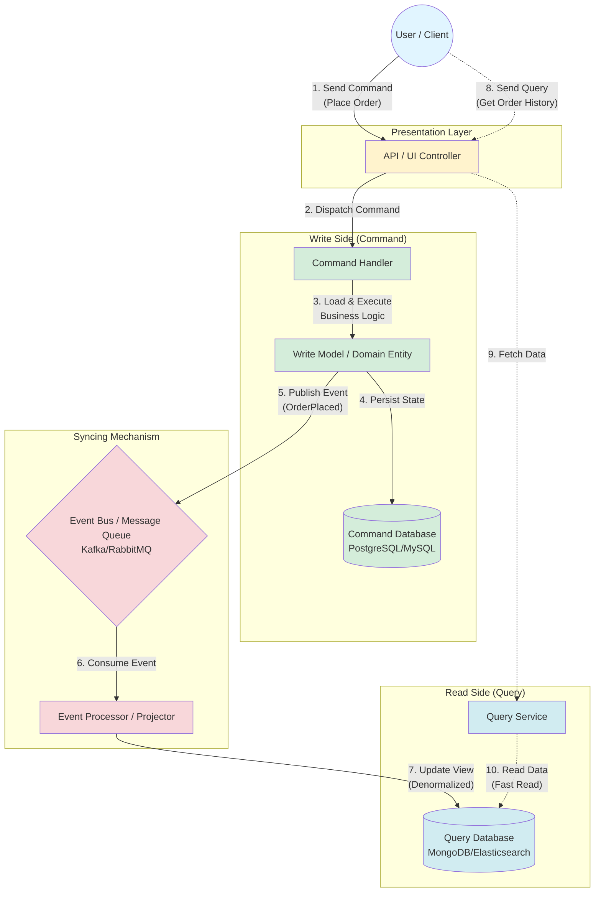

# CQRS Architecture: A Complete Guide

## Table of Contents
- [What is CQRS?](#what-is-cqrs)
- [Architecture Overview](#architecture-overview)
- [Architecture Diagram](#architecture-diagram)
- [Real-World Scenario: Placing an Order](#real-world-scenario-placing-an-order)
- [Detailed Flow Explanation](#detailed-flow-explanation)
- [Why Use CQRS?](#why-use-cqrs)
- [Technology Stack Examples](#technology-stack-examples)
- [Best Practices](#best-practices)

---

## What is CQRS?

**CQRS** stands for **Command Query Responsibility Segregation**. It's an architectural pattern that separates the operations that modify data (Commands) from the operations that read data (Queries).

### Key Principles:
- **Commands**: Change the state of the system (Write operations)
- **Queries**: Return data without changing state (Read operations)
- **Separation**: Different models for reading and writing data

---

## Architecture Overview

The CQRS architecture consists of three main components:

1. **Write Side (Command Side)**: Handles all data modifications
2. **Syncing Mechanism**: Keeps read and write sides in sync using events
3. **Read Side (Query Side)**: Handles all data retrieval operations

---

## Architecture Diagram



---

## Real-World Scenario: Placing an Order

Let's visualize this flow when a user on **Amazon** or a similar e-commerce site clicks **"Buy Now"**.

### Phase 1: The Write Side (Making the Change)

**Goal**: Ensure the order is valid and save it securely.

#### 1. Presentation Layer (The Trigger)
- **Action**: User clicks "Buy Now"
- **Data Sent**: 
  ```json
  {
    "command": "PlaceOrder",
    "productId": "12345",
    "userId": "user-789",
    "quantity": 2,
    "timestamp": "2026-02-02T10:30:00Z"
  }
  ```
- **Result**: The frontend sends this payload to the API

#### 2. Command Handler (The Coordinator)
- **Role**: Traffic cop that orchestrates the operation
- **Responsibilities**:
  - Validates the command structure
  - Loads the appropriate Write Model (Order entity)
  - Delegates business logic execution
  - Doesn't contain business logic itself

#### 3. Write Model (The Brain)
- **Role**: Contains all business logic
- **Validation Checks**:
  - ✓ Is the item in stock?
  - ✓ Is the payment method valid?
  - ✓ Is the shipping address complete?
  - ✓ Are there any business rule violations?
- **State Change**: If valid → Status = `ORDER_CONFIRMED`

#### 4. Command Database (The Source of Truth)
- **Database Type**: Relational (PostgreSQL, MySQL)
- **Characteristics**:
  - Normalized schema
  - ACID compliance
  - Optimized for data integrity
  - **NOT** optimized for fast reads
- **Data Stored**:
  ```sql
  INSERT INTO orders (order_id, user_id, product_id, quantity, status, created_at)
  VALUES ('ORD-001', 'user-789', '12345', 2, 'CONFIRMED', NOW());
  ```

---

### Phase 2: The Sync (The Event Concept)

**Goal**: Update the Query Database so the user can see their order history fast.

#### 5. Publishing the Event
- **What Happens**: Once the command succeeds, the Write Model publishes an event
- **Event Example**:
  ```json
  {
    "eventType": "OrderPlaced",
    "orderId": "ORD-001",
    "userId": "user-789",
    "productId": "12345",
    "productName": "Wireless Headphones",
    "quantity": 2,
    "totalPrice": 59.98,
    "timestamp": "2026-02-02T10:30:05Z"
  }
  ```
- **Destination**: Message Broker (RabbitMQ, Kafka, AWS SQS)

#### 6. Event Processor (The Sync Agent)
- **Role**: Background worker listening for events
- **Process**:
  1. Consumes `OrderPlacedEvent` from the queue
  2. Transforms the data for read optimization
  3. Prepares denormalized view

#### 7. Query Database (The Read Optimized View)
- **Database Type**: NoSQL (MongoDB, Elasticsearch, Redis)
- **Optimization Strategy**:
  - Denormalized data (no joins needed)
  - Pre-calculated totals
  - User-friendly format
- **Data Stored**:
  ```json
  {
    "_id": "ORD-001",
    "user": {
      "id": "user-789",
      "name": "John Doe",
      "email": "john@example.com"
    },
    "product": {
      "id": "12345",
      "name": "Wireless Headphones",
      "image": "https://cdn.example.com/headphones.jpg"
    },
    "quantity": 2,
    "pricePerUnit": 29.99,
    "totalPrice": 59.98,
    "tax": 5.40,
    "grandTotal": 65.38,
    "status": "CONFIRMED",
    "orderDate": "2026-02-02T10:30:05Z"
  }
  ```

---

### Phase 3: The Read Side (Consuming Data)

**Goal**: Show the user their data instantly.

#### 8. Presentation Layer (The Query)
- **Action**: User navigates to "My Orders" page
- **Request**: `GET /api/orders?userId=user-789`

#### 9. Query Service
- **Role**: Handles all read operations
- **Characteristics**:
  - No business logic
  - No data modification
  - Simple data retrieval

#### 10. Query Database Access
- **Process**:
  ```javascript
  // Simple MongoDB query - No joins, No calculations
  db.orders.find({ "user.id": "user-789" })
            .sort({ orderDate: -1 })
            .limit(20)
  ```
- **Response Time**: < 50ms (because everything is pre-calculated)
- **Result**: JSON sent directly to the frontend

---

## Detailed Flow Explanation

### Command Flow (Steps 1-5)
```
User Action → API Endpoint → Command Handler → Write Model → Command DB → Event Published
```

**Example Timeline**:
- `T+0ms`: User clicks "Buy Now"
- `T+10ms`: API receives PlaceOrderCommand
- `T+20ms`: Command Handler validates and loads Order entity
- `T+50ms`: Business logic executes (inventory check, payment validation)
- `T+100ms`: Order saved to Command Database
- `T+110ms`: OrderPlacedEvent published to Event Bus
- `T+120ms`: User sees "Order Confirmed!" message

### Sync Flow (Steps 6-7)
```
Event Bus → Event Processor → Transform Data → Update Query DB
```

**Example Timeline**:
- `T+120ms`: Event appears in Kafka topic
- `T+150ms`: Event Processor picks up the event
- `T+200ms`: Data transformed and denormalized
- `T+250ms`: Query Database updated
- **Note**: This happens asynchronously - user doesn't wait for this

### Query Flow (Steps 8-10)
```
User Request → API → Query Service → Query DB → Return Data
```

**Example Timeline**:
- `T+0ms`: User opens "My Orders" page
- `T+10ms`: API receives query request
- `T+20ms`: Query Service fetches from MongoDB
- `T+30ms`: Data returned to frontend
- `T+50ms`: User sees their order history

---

## Why Use CQRS?

### 1. **Performance**
- **Write Side**: Optimized for data integrity and consistency
- **Read Side**: Optimized for speed and scalability
- **Result**: You can handle 1 million reads/sec while maintaining strict write consistency

### 2. **Scalability**
- Scale read and write databases independently
- Use different technologies for different needs:
  - PostgreSQL for writes (ACID compliance)
  - Elasticsearch for searches
  - Redis for caching
  - MongoDB for general queries

### 3. **Decoupling**
- **Resilience**: If Query DB goes down, writes still work
- **Flexibility**: Change read models without affecting write logic
- **Recovery**: Rebuild read models from event history

### 4. **Complex Business Logic**
- Write Model focuses purely on business rules
- No compromise between write integrity and read performance

### 5. **Audit Trail**
- Every change generates an event
- Complete history of what happened and when
- Easy compliance with regulations (GDPR, SOX, HIPAA)

---

## Technology Stack Examples

### Option 1: Cloud-Native Stack
```
┌─────────────────────────────────────────┐
│ Presentation: React/Next.js             │
├─────────────────────────────────────────┤
│ API Gateway: AWS API Gateway            │
├─────────────────────────────────────────┤
│ Command Side: Lambda + RDS PostgreSQL   │
├─────────────────────────────────────────┤
│ Event Bus: AWS EventBridge / SNS+SQS    │
├─────────────────────────────────────────┤
│ Query Side: Lambda + DynamoDB           │
└─────────────────────────────────────────┘
```

### Option 2: Enterprise Stack
```
┌─────────────────────────────────────────┐
│ Presentation: Angular/Vue.js            │
├─────────────────────────────────────────┤
│ API: Spring Boot / .NET Core            │
├─────────────────────────────────────────┤
│ Command Side: PostgreSQL                │
├─────────────────────────────────────────┤
│ Event Bus: Apache Kafka                 │
├─────────────────────────────────────────┤
│ Query Side: Elasticsearch + MongoDB     │
└─────────────────────────────────────────┘
```

### Option 3: Microservices Stack
```
┌─────────────────────────────────────────┐
│ API Gateway: Kong/Nginx                 │
├─────────────────────────────────────────┤
│ Command Service: Node.js + PostgreSQL   │
├─────────────────────────────────────────┤
│ Event Bus: RabbitMQ                     │
├─────────────────────────────────────────┤
│ Query Service: Node.js + MongoDB        │
├─────────────────────────────────────────┤
│ Cache Layer: Redis                      │
└─────────────────────────────────────────┘
```

---

## Best Practices

### 1. Event Design
✅ **DO**: Make events immutable and self-contained
```json
{
  "eventId": "evt-12345",
  "eventType": "OrderPlaced",
  "aggregateId": "ORD-001",
  "timestamp": "2026-02-02T10:30:05Z",
  "data": { /* all necessary data */ },
  "metadata": { "userId": "user-789", "source": "web-app" }
}
```

❌ **DON'T**: Reference external data
```json
{
  "eventType": "OrderPlaced",
  "orderId": "ORD-001"
  // Missing critical data - requires lookup
}
```

### 2. Eventual Consistency
- **Accept**: Read side may be slightly behind (milliseconds to seconds)
- **Communicate**: Show "Processing..." states in UI
- **Handle**: Use correlation IDs to track event processing

### 3. Error Handling
- **Command Failures**: Return errors immediately to user
- **Event Processing Failures**: Implement retry logic with dead letter queues
- **Recovery**: Store events to rebuild read models if needed

### 4. Monitoring
Track these metrics:
- Command processing time
- Event lag (time between publish and processing)
- Query response times
- Event processing failures

### 5. When NOT to Use CQRS
❌ Simple CRUD applications
❌ Low traffic systems
❌ When team lacks experience with distributed systems
❌ When eventual consistency is unacceptable

---

## Conclusion

CQRS is a powerful pattern for building scalable, high-performance systems. By separating reads from writes, you gain:

- **Performance**: Optimize each side independently
- **Scalability**: Scale reads and writes separately  
- **Flexibility**: Use the right database for each job
- **Resilience**: Failures in one side don't affect the other

However, it adds complexity. Use it when the benefits outweigh the costs—typically in systems with:
- High read/write ratios
- Complex business logic
- Need for independent scaling
- Audit trail requirements

---

## Additional Resources

- [Martin Fowler on CQRS](https://martinfowler.com/bliki/CQRS.html)
- [Microsoft CQRS Pattern](https://docs.microsoft.com/en-us/azure/architecture/patterns/cqrs)
- [Event Sourcing Pattern](https://martinfowler.com/eaaDev/EventSourcing.html)

---

